---
html:
  embed_local_images: true
  embed_svg: true
  offline: true
  toc: true
toc:
  depth_from: 1
  depth_to: 3
print_background: false
---

# OTIO Core Data Model Specification

## Introduction (informative)

This document specifies the core OTIO data model, which is summarized below.

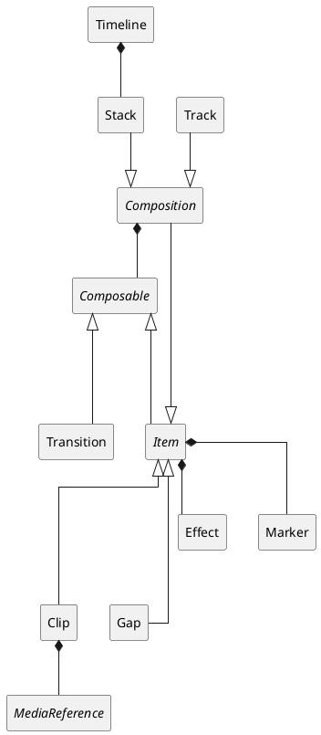

All OTIO classes derive directly or indirectly from [`SerializableObject`](#object-model-SerializableObject) and multiple instances of OTIO classes can be collected as a [`SerializableCollection`](#object-model-SerializableCollection).

Subclasses of [`MediaReference`](#object-model-MediaReference) are defined to handle specific kinds of reference to media:

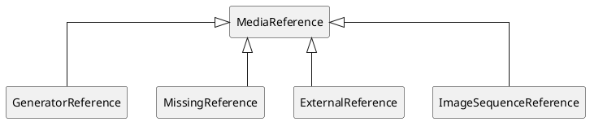

Similarly, subclasses of [`Effect`](#object-model-Effect) are defined to handle specific kinds of audio-visual effects:

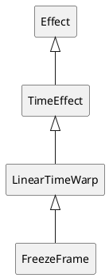

## References

OMG, Unified Modeling Language Specification Version 2.5.1 (url: https://www.omg.org/spec/UML/2.5.1)
(https://tools.ietf.org/rfc/bcp/bcp14.txt)

IETF, BCP 14, Key words for use in RFCs to Indicate Requirement Levels (url: https://tools.ietf.org/rfc/bcp/bcp14.txt)

## Conventions

All sections are normative, unless otherwise indicated.

The model diagrams are specified using UML as specified in OMG UML. The diagram below illustrates the notation most commonly used in this specification.

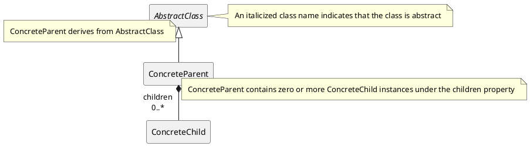

The key words MAY, SHALL, SHALL NOT, SHOULD, and SHOULD NOT in this document are to be interpreted as described in IETF BCP 14.

## Object Model

### General

This version of the document specifies a single version of the abstract OTIO object model, which consists of the unique set of class
and data type definitions specified herein.

Any modification to the requirements associated with these definitions results in a different version of the data model.

Each concrete representation of a particular version of the OTIO object model is called a serialization, and each serialization
shall specify a mechanism by which the version of the data model is signalled.

### JSON Serialization

This document specifies a serialization using the [JSON interchange format](https://json.org). Other serializations may exist.

In this serialization:

* each descendent of the [`SerializableObject`](#object-model-SerializableObject) includes a `OTIO_SCHEMA` property, which is
  altered whenever any requirements associated with a class is modified or added -- allowing an implementation to infer the version of the
  object model;

* abstract classes cannot be serialized and no schema definitions exist for them;

* the serialization for both current and past versions of classes is specified; and

* the process by which the serialization of an earlier version of a class is converted to a current version of the class is
  specified.

Implementations shall accept the serialization of all versions of the data model specified herein.

Implementation should create a serialization of the current version of the data model unless:

* compatibility with legacy implementations is required, in which case earlier version of a class may be serialized; or

* the specification explicitly forbids the serialization to an earlier version of a class.

### SerializableObject {#object-model-SerializableObject}

#### Introduction (informative)

Superclass for all classes whose instances can be serialized.

#### Model

##### Diagram

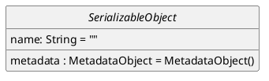

##### name

This property identifies the object.

_NOTE_: This property is intended for human consumption and there are no uniqueness requirements for its value.

##### metadata

This property contains information that further describes the object.

#### JSON Schema

```json
"SerializableObject": {
  "anyOf" : [
    { "$ref": "#/definitions/Composable" },
    { "$ref": "#/definitions/Marker" },
    { "$ref": "#/definitions/Effect" },
    { "$ref": "#/definitions/MediaReference" },
    { "$ref": "#/definitions/Timeline" },
    { "$ref": "#/definitions/SerializableCollection" }
  ]
}
```

### SerializableCollection {#object-model-SerializableCollection}

#### Introduction (informative)

A `SerializableCollection` object represents a generic container of other objects.

No timing relationship between its `children` objects is implied, in contrast to a `Composition` for example.

_EXAMPLES_: A bin of media, a bundle of timelines in a single file. Specifically, the AAF adapter will output a SerializableCollection that contains multiple Timelines when reading an AAF that contains multiple compositions. Also, the ALE adapter outputs a SerializableCollection of Clips. For some workflows a SerializableCollection and a Track could be used interchangably in practice, but we wanted SerializableCollection to be more generic and able to hold non-Composable objects like Markers, etc.

#### Model

##### Diagram

```puml
@startuml
hide empty members
hide circle
skinparam classAttributeIconSize 0

class SerializableCollection {
}

SerializableObject <|-- SerializableCollection

SerializableCollection *-- "children\r0..*" SerializableObject

@enduml
```

##### children

This property defines the timeline of the object.

#### JSON Schema

```json
"SerializableCollection": {
  "type": "object",
  "properties" : {
    "OTIO_SCHEMA" : {
      "anyOf" : [
        { "const": "SerializableCollection.1" },
        {
          "const": "SerializeableCollection.1",
          "deprecated": true
        }
      ]
    },
    "name" : { "$ref": "#/definitions/NullableString" },
    "metadata" : { "$ref": "#/definitions/MetadataObject" },
    "children" : {
      "type" : "array",
      "items" : { "$ref": "#/definitions/SerializableObject" }
    }
  },
  "required" : ["OTIO_SCHEMA"],
  "additionalProperties": false
}
```

### Timeline {#object-model-Timeline}

#### Introduction (informative)

A `Timeline` object represents a complete project. The media timeline of the object is referenced by its `tracks` property.

#### Model

##### Diagram

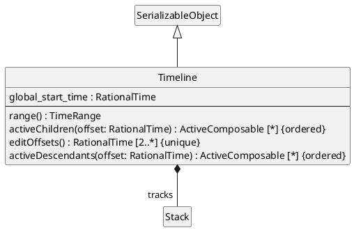

_EDITOR'S NOTE_: Why can't `Timeline` derive from `Stack`?

##### tracks

This property defines the timeline of the object.

##### global_start_time

This property indicates the start of the object's timeline from the start of the timeline defined by the `tracks` property.

_EDITOR'S NOTE_: What is exactly `global_start_time`? What is it relative to?

##### range()

This method returns the interval `[global_start_time, tracks.range().duration())`.

##### activeChildren()

This method returns `tracks.activeChildren(offset)`.

##### editOffsets()

This method returns `tracks.editOffsets(offset)`.

##### activeDescendants()

This method returns `tracks.activeDescendants(offset)`;

#### JSON Schema

```json
"Timeline": {
  "type": "object",
  "properties" : {
    "OTIO_SCHEMA" : {
      "const": "Timeline.1"
    },
    "name" : { "$ref": "#/definitions/NullableString" },
    "metadata" : { "$ref": "#/definitions/MetadataObject" },
    "global_start_time" : { "$ref": "#/definitions/NullableRationalTime" },
    "tracks" : { "$ref": "#/definitions/Stack" }
  },
  "required" : ["OTIO_SCHEMA"],
  "additionalProperties": false
}
```

### Stack {#object-model-Stack}

#### Introduction (informative)

A `Stack` represents a collection of chidren `Composable` objects that are arranged such that their start times are coincident.

Most commonly, this would be a series of `Track` objects that contain `Clip` objects. The 0-time of those `Track` objects would be coincide with the 0-time of the `Stack` object.

The children objects are in compositing order, with later (towards top) children obscuring earlier (towards bottom) children. If a `Stack` object has three children, [A, B, C], C is above B which is above A.

The duration of a `Stack` is the duration of its longest child.  If a child ends before the other children, then an earlier index child would be visible before it.

The timing model of a `Stack` object is illustrated below.


#### Model

##### Diagram

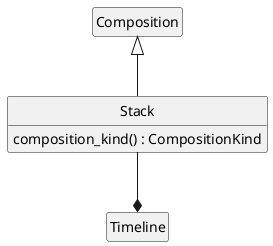

##### composition_kind()

The method returns `CompositionKind::Stack`.

#### JSON Schema

```json
"Stack": {
  "type": "object",
  "properties" : {
    "OTIO_SCHEMA" : {
      "const": "Stack.1"
    },
    "name" : { "$ref": "#/definitions/NullableString" },
    "metadata" : { "$ref": "#/definitions/MetadataObject" },
    "source_range" : { "$ref": "#/definitions/TimeRange" },
    "markers" : {
      "type" : "array",
      "items" : {"$ref": "#/definitions/Marker"}
    },
    "effects" : {
      "type" : "array",
      "items" : {"$ref": "#/definitions/Effect"}
    },
    "children" : {
      "type" : "array",
      "items" : {"$ref": "#/definitions/Composable"}
    }
  },
  "required" : ["OTIO_SCHEMA"]
}
```

### Track {#object-model-Track}

#### Introduction (informative)

A `Track` represents a collection of chidren `Composable` objects that are arranged sequentially in time.

The duration of a `Track` is the sum of the duration of its children.

The timing model of a `Track` object is illustrated below.


#### Model

##### Diagram

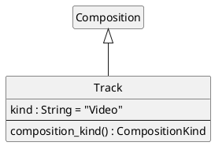

##### kind

This property uniquely identifies the kind of essence produced by the `Track`.

The following are two values are defined:

* `"Video"`
* `"Audio"`

_EDITOR'S NOTE_: is a `track` always of a single kind?

##### composition_kind()

The method returns `CompositionKind::Track`.

#### JSON Schema

```json
"Track": {
  "type": "object",
  "properties" : {
    "OTIO_SCHEMA" : {
      "anyOf" : [
        { "const": "Track.1" },
        {
          "const": "Sequence.1",
          "deprecated": true
        }
      ]
    },
    "name" : { "$ref": "#/definitions/NullableString" },
    "metadata" : { "$ref": "#/definitions/MetadataObject" },
    "source_range" : {"$ref": "#/definitions/TimeRange"},
    "markers" : {
      "type" : "array",
      "items" : {"$ref": "#/definitions/Marker"}
    },
    "effects" : {
      "type" : "array",
      "items" : {"$ref": "#/definitions/Effect"}
    },
    "children" : {
      "type" : "array",
      "items" : {"$ref": "#/definitions/Composable"}
    },
    "kind" : { "$ref": "#/definitions/NullableString" }
  },
  "required" : ["OTIO_SCHEMA", "kind"],
  "additionalProperties": false
}
```

### Composable {#object-model-Composable}

#### Introduction (informative)

A `Composable` object defines a media timeline over a temporal range.

#### Model

##### Diagram

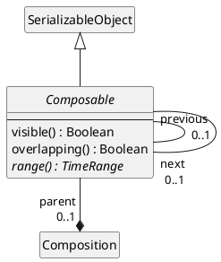

##### parent

This property contains a reference to the parent of the object.

_EDITOR'S NOTE_: `self.parent` is `null` when the `Composable` object is a child of a `SerializableCollection`.

##### previous

This property references the previous sibling of the object in the `parent`, if one exists.

##### next

This property references the next sibling of the object in the `parent`, if one exists. 

##### visible()

This method indicates whether the object is visible.

This method returns `false`.

_EDITOR'S NOTE_: The inline code documentation is inconsistent. Does "visible" mean "produce visible output" or "contributes to the timeline" or ...? It looks like this is used only for the stacking algorithm... but how does it apply to audio tracks?

##### overlapping()

This method indicates whether the object is overlapping.

This method returns `false`.

_EDITOR'S NOTE_: It looks like this is primarily used in the code to differentiate `Item` and `Transition` objects. Why not differentiate them based on their root classes, or is it possible for an `Item` object to be overlapping?

##### range()

This method returns the temporal interval over which the object timeline is defined.

#### JSON Schema

```json
"Composable": {
  "anyOf" : [
    { "$ref": "#/definitions/Transition" },
    { "$ref": "#/definitions/Item" }
  ]
}
```

### Item {#object-model-Item}

#### Introduction (informative)

An `Item` object positions media on a media timeline. It can also hold effects (`Effect` objects) and markers (`Marker` objects).

#### Model

##### Diagram

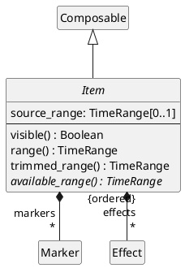

##### source_range

This property modifies the interval of the object timeline -- see `range()`.

_NOTE_: Usually `source_range` is within `self.available_range()` but this is not a requirement. Some use cases will intentionally ask for a `Clip` that is longer (or starts earlier) than the available media as a way to request that new media (a newly animated take, or newly recorded audio) be made to fill the requested `source_range`.

##### effects

This property specifies `Effect` objects applied, in order, to the `Item`.

_EDITOR'S NOTE_: Why are effects and transitions different?

##### markers

This property specifies `Marker` objects associated with the object.

##### visible()

This method returns returns `true`.

##### available_range()

This method returns the temporal range over which media is available.

_NOTE_: This method always returns a valid `TimeRange` object.

##### range()

This method returns:

* `self.source_range`, if `self.source_range` is not `null`; or
* `self.available_range()`, otherwise.

##### trimmed_range()

This method returns `self.range()`.

_EDITOR'S NOTE_: Suggest replacing `trimmed_range()` with `range()`, which applies to `Item` objects as well as `Transition` objects.

#### JSON Schema

```json
"Item": {
  "anyOf" : [
    { "$ref": "#/definitions/Gap" },
    { "$ref": "#/definitions/Clip" },
    { "$ref": "#/definitions/Composition" }
  ]
}
```

### Effect {#object-model-Effect}

#### Introduction

This class represents an effect applied to its parent `Item`.

#### Model

##### Diagram

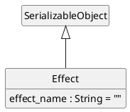

_NOTE_: Effect specialization is handled as subclasses since they affect timing, whereas transition and generators are handled as paramterized classes.

_EDITOR'S NOTE_: Should there be a `properties` property like with `Transition`.

##### effect_name

This property identifies the effect.

_NOTE_: Ideally, `Effect` (or one of its subclasses) is subclassed to accurately
capture the semantics of a particular effect. It is not however expected that a
subclass exist for every single effect used in practice. Instead, the
`effect_name` property can be used to identify an effect more precisely than its
class can.

_EXAMPLE 1_: A complex time remap from a DCC might be represented as a
LinearTimeWarp in OTIO and have detailed retiming information placed in the
format-specific namespace in the metadata dictionary for that effect instance.
OTIO and other format adapters can treat that effect with the LinearTimeWarp
schema semantics, but if the original adapter is invoked it could still detect
the original effect type and translate it back accurately. Similarly, scripts
written by consumers of the OTIO representation might be able to reach in and
gather useful information even if the effect's behavior is represented by OTIO
in a "Lossy" way.

_EXAMPLE 2_: Example values include: `"Blur"`, `"Crop"`, `"Flip"`.

#### JSON Schema

```json
"Effect": {
  "anyOf" : [
    {
      "type": "object",
      "properties" : {
        "OTIO_SCHEMA" : {
          "const": "Effect.1"
        },
        "name" : { "$ref": "#/definitions/NullableString" },
        "metadata" : { "$ref": "#/definitions/MetadataObject" },
        "effect_name" : { "$ref": "#/definitions/NullableString" }
      },
      "required" : ["OTIO_SCHEMA"],
      "additionalProperties": false
    },
    { "$ref": "#/definitions/TimeEffect" }
  ]
}
```

### TimeEffect {#object-model-TimeEffect}

#### Introduction

Parent class for `Effect` objects that manipulate time.

#### Model

```puml
@startuml
hide empty members
hide circle
skinparam classAttributeIconSize 0

class TimeEffect

Effect <|-- TimeEffect

@enduml
```

#### JSON Schema

```json
"TimeEffect": {
  "anyOf" : [
    {
      "type": "object",
      "properties" : {
        "OTIO_SCHEMA" : {
          "const": "TimeEffect.1"
        },
        "name" : { "$ref": "#/definitions/NullableString" },
        "metadata" : { "$ref": "#/definitions/MetadataObject" },
        "effect_name" : { "$ref": "#/definitions/NullableString" }
      },
      "required" : ["OTIO_SCHEMA"],
      "additionalProperties": false
    },
    { "$ref": "#/definitions/FreezeFrame" },
    { "$ref": "#/definitions/LinearTimeWarp" }
  ]
}
```

### LinearTimeWarp {#object-model-LinearTimeWarp}

#### Introduction

A time warp that applies a linear scale across the entire parent `Item`.

#### Model

##### Diagram

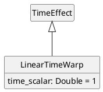

##### time_scalar

This property specifies the linear time scalar applied to clip.

_EXAMPLE_: `timescalar = 2.0` means double speed, and `timescalar = 0.5` means half speed.

#### JSON Schema

```json
"LinearTimeWarp": {
  "type": "object",
  "properties" : {
    "OTIO_SCHEMA" : {
      "const": "LinearTimeWarp.1"
    },
    "name" : { "$ref": "#/definitions/NullableString" },
    "metadata" : { "$ref": "#/definitions/MetadataObject" },
    "effect_name" : { "$ref": "#/definitions/NullableString" },
    "time_scalar" : { "$ref": "#/definitions/NullableDouble" }
  },
  "required" : ["OTIO_SCHEMA"],
  "additionalProperties": false
}
```

### FreezeFrame {#object-model-FreezeFrame}

#### Introduction

This effect holds the first frame of the item for the duration of the parent `Item`.

#### Model

##### Diagram

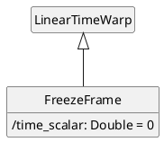

###### time_scalar

The property shall be equal to 0.

#### JSON Schema

```json
"FreezeFrame": {
  "type": "object",
  "properties" : {
    "OTIO_SCHEMA" : {
      "const": "FreezeFrame.1"
    },
    "name" : { "$ref": "#/definitions/NullableString" },
    "metadata" : { "$ref": "#/definitions/MetadataObject" },
    "effect_name" : { "$ref": "#/definitions/NullableString" },
    "time_scalar" : { "const": 0 }
  },
  "required" : ["OTIO_SCHEMA"],
  "additionalProperties": false
}
```

### Marker {#object-model-Marker}

#### General

This class holds metadata over time on a timeline.

#### Model

##### Diagram

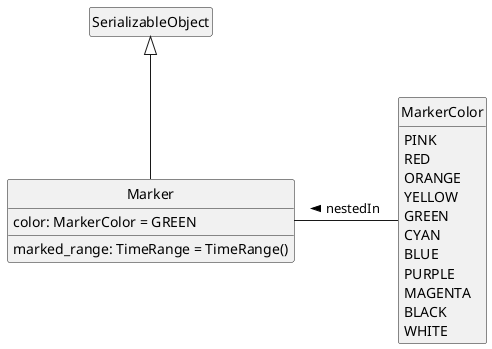

_EDITOR'S NOTE_: Should `MarkerColor` allow any sRGB color value?

##### marked_range

Range this marker applies to, relative to the Item this marker is attached to (e.g. the Clip or Track that owns this marker).

##### color

Color of the `Marker` object.

#### JSON Schema

```json
"Marker" : {
    "anyOf" : [
    { "$ref": "#/definitions/Marker.1" },
    { "$ref": "#/definitions/Marker.2" }
  ]
}
```

```json
"Marker.2" : {
  "type": "object",
  "properties": {
    "OTIO_SCHEMA" : {
      "const": "Marker.2"
    },
    "name" : { "$ref": "#/definitions/NullableString" },
    "metadata" : { "$ref": "#/definitions/MetadataObject" },
    "marked_range" : { "$ref": "#/definitions/TimeRange" },
    "color" : {
      "type": "string",
      "enum": ["PINK", "RED", "ORANGE", "YELLOW", "GREEN", "CYAN", "BLUE", "PURPLE", "MAGENTA", "BLACK", "WHITE"]
    }
  },
  "required" : ["OTIO_SCHEMA"],
  "additionalProperties": false
}
```

```json
"Marker.1" : {
  "deprecated" : true,
  "type": "object",
  "properties": {
    "OTIO_SCHEMA" : {
      "const": "Marker.1"
    },
    "name" : { "$ref": "#/definitions/NullableString" },
    "metadata" : { "$ref": "#/definitions/MetadataObject" },
    "range" : { "$ref": "#/definitions/TimeRange" },
    "color" : {
      "type": "string",
      "enum": ["PINK", "RED", "ORANGE", "YELLOW", "GREEN", "CYAN", "BLUE", "PURPLE", "MAGENTA", "BLACK", "WHITE"]
    }
  },
  "required" : ["OTIO_SCHEMA"],
  "additionalProperties": false
}
```

_NOTE_: The `range` property in the deprecated `Marker.1` serialization corresponds to the `marked_range` property in the data model.

### Transition {#object-model-Transition}

#### General

A `Transition` object corresponds to an overlap between the previous and next `Item` objects in a `Track` objects. In common usage this is a video cross-dissolve, wipe, audio cross-fade, or blend between two `Clip` objects.

The timeline of the `Transition` object `obj` corresponds to the temporal transition from the first to second of the following coterminous intervals:

* the interval `[obj.previous.range.end - obj.in_offset, obj.previous.range.end - obj.in_offset + obj.range().duration())` within the timeline of `obj.previous`, if it exists; and
* the interval `[obj.next.range.start - obj.out_offset, obj.next.range.start - obj.out_offset + obj.range().duration())` within the timeline of `obj.next`, if it exists.

_NOTE_: Coterminous means that the two intervals overlap from start to end.

#### Model

##### Diagram

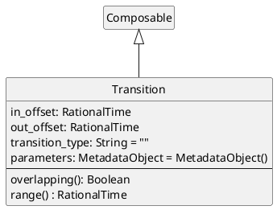

_EDITOR'S NOTE_: It is surprising that a transition at the start or end of a track generates a `Gap` whose duration is equal to `in_offset` or `out_offset` respectively, so that the duration of the `Track` is increased implicitly, but no `Gap` is generated when `in_offset` is larger than the previous sibling.

##### in_offset

This property specifies the temporal overlap with the previous `Item` in the parent `Composition` object.

`self.in_offset` shall be equal to or greater than 0.

If `self.previous` is not `null`, then `self.in_offset` shall be smaller than or equal to `self.previous.range().duration()`.

##### out_offset

This property specifies the temporal overlap with the next `Item` in the parent `Composition` object.

`self.out_offset` shall be equal to or greater than 0.

If `self.next` is not `null`, then `self.out_offset` shall be smaller than or equal to `self.next.range().duration()`.

##### transition_type

This property identifies the kind of transition applied by the object.

##### parameters

This property specifies parameters for the transition applied by the object.

##### next

`self.next` shall be an `Item` object or `null`.

##### previous

`self.previous` shall be an `Item` object or `null`.

##### overlapping()

This method returns `true`.

##### range()

This method returns the interval `[0, self.out_offset + self.in_offset)`.

#### JSON Schema

```json
"Transition" : {
  "type": "object",
  "properties": {
    "OTIO_SCHEMA" : {
      "const": "Transition.1"
    },
    "name" : { "$ref": "#/definitions/NullableString" },
    "metadata" : { "$ref": "#/definitions/MetadataObject" },
    "in_offset" : { "$ref": "#/definitions/NullableRationalTime" },
    "out_offset" : { "$ref": "#/definitions/NullableRationalTime" },
    "transition_type" : { "$ref": "#/definitions/NullableString" },
    "parameters" : {
      "type" : "object"
    }
  },
  "required" : ["OTIO_SCHEMA", "transition_type"],
  "additionalProperties": false
}
```

### Gap {#object-model-Gap}

#### General

This class represents the absence of media.

#### Model

##### Diagram

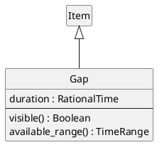

##### duration

This property is the duration of the gap.

##### visible()

This method returns `false`.

##### available_range()

The method returns the interval `[0, duration)`.

#### JSON Schema

```json
"Gap" : {
  "type": "object",
  "properties": {
    "OTIO_SCHEMA" : {
      "anyOf" : [
        { "const": "Gap.1" },
        {
          "const": "Filler.1",
          "deprecated": true
        }
      ]
    },
    "name" : { "$ref": "#/definitions/NullableString" },
    "metadata" : { "$ref": "#/definitions/MetadataObject" },
    "markers" : {
      "type" : "array",
      "items" : {"$ref": "#/definitions/Marker"}
    },
    "effects" : {
      "type" : "array",
      "items" : {"$ref": "#/definitions/Effect"}
    },
    "source_range" : { "$ref": "#/definitions/TimeRange" },
    "duration" : { "$ref": "#/definitions/NullableRationalTime" }
  },
  "required" : ["OTIO_SCHEMA"],
  "additionalProperties": false
}
```

### Clip {#object-model-Clip}

#### General

A `Clip` object positions the media referenced by the `media_reference` property on its timeline.

A temporal offset `t` in the object timeline corresponds to the temporal offset `t` into the media referenced by the `media_reference` property.

#### Model

##### Diagram

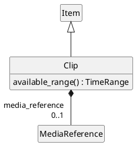

##### available_range()

The method returns:

* a copy of `self.media_reference.available_range` if `self.media_reference` is not `null` and `self.media_reference.available_range` is not `null`; or
* a new `TimeRange`, otherwise.

_EDITOR'S NOTE_: A zero-duration `TimeRange` is returned if the actual `available_range` of the underlying media is unknown.

##### media_reference

This property references the media associated with the object.

#### JSON Schema

```json
"Clip" : {
  "type": "object",
  "properties": {
    "OTIO_SCHEMA" : {
      "const": "Clip.1"
    },
    "name" : { "$ref": "#/definitions/NullableString" },
    "metadata" : { "$ref": "#/definitions/MetadataObject" },
    "markers" : {
      "type" : "array",
      "items" : {"$ref": "#/definitions/Marker"}
    },
    "effects" : {
      "type" : "array",
      "items" : {"$ref": "#/definitions/Effect"}
    },
    "source_range" : { "$ref": "#/definitions/TimeRange" },
    "media_reference" : { "$ref": "#/definitions/MediaReference" }
  },
  "required" : ["OTIO_SCHEMA"],
  "additionalProperties": false
}
```

### MediaReference {#object-model-MediaReference}

#### General

This class identifies media to be placed on the timeline.

#### Model

##### Diagram

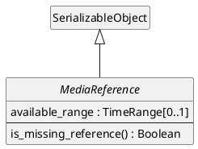

##### available_range

This property indicates the temporal interval of media available.

##### is_missing_reference()

This method indicates whether the media underlying the reference is available (`is_missing_reference() === false`) or missing (`is_missing_reference() === true`).

This method returns `false`.

#### JSON Schema

```json
"MediaReference" : {
   "anyOf" : [
    { "$ref": "#/definitions/MissingReference" },
    { "$ref": "#/definitions/ExternalReference" },
    { "$ref": "#/definitions/GeneratorReference" },
    { "$ref": "#/definitions/ImageSequenceReference"},
    { "type": "null"}
  ]
}
```

### ExternalReference {#object-model-ExternalReference}

#### General

Reference to media via a URI.

#### Model

##### Diagram

```puml
@startuml
hide empty members
hide circle
skinparam classAttributeIconSize 0

MediaReference <|-- ExternalReference

class ExternalReference {
  target_url: URI = URI()
}

@enduml
```

##### target_url

This property is a URI to the media.

#### JSON Schema

```json
"ExternalReference" : {
  "type": "object",
  "properties": {
    "OTIO_SCHEMA" : {
      "const": "ExternalReference.1"
    },
    "name" : { "$ref": "#/definitions/NullableString" },
    "metadata" : { "$ref": "#/definitions/MetadataObject" },
    "available_range" : { "$ref": "#/definitions/TimeRange" },
    "target_url" : { "$ref": "#/definitions/NullableURI" }
  },
  "required" : ["OTIO_SCHEMA", "available_range", "target_url"],
  "additionalProperties": false
}
```

### GeneratorReference {#object-model-GeneratorReference}

#### General

Generators are media references that become "generators" in editorial systems.  For example, color bars or a solid color.

#### Model

##### Diagram

```puml
@startuml
hide empty members
hide circle
skinparam classAttributeIconSize 0

MediaReference <|-- GeneratorReference

class GeneratorReference {
  generator_kind: String = ""
  parameters: MetadataObject = MetadataObject()
}

@enduml
```

##### generator_kind

This property identifies the operation of the generator.

##### parameters

This property specifies parameters to be provided to the generator.

#### JSON Schema

```json
"GeneratorReference" : {
  "type": "object",
  "properties": {
    "OTIO_SCHEMA" : {
      "const": "GeneratorReference.1"
    },
    "name" : { "$ref": "#/definitions/NullableString" },
    "metadata" : { "$ref": "#/definitions/MetadataObject" },
    "generator_kind" : { "$ref": "#/definitions/NullableString" },
    "available_range" : { "$ref": "#/definitions/TimeRange" },
    "parameters" : {
      "type" : "object"
    }
  },
  "required" : ["OTIO_SCHEMA", "generator_kind"],
  "additionalProperties": false
}
```

### MissingReference {#object-model-MissingReference}

#### General

This class represents media for which a concrete reference is missing.

#### Model

##### Diagram

```puml
@startuml
hide empty members
hide circle
skinparam classAttributeIconSize 0

MediaReference <|-- MissingReference

class MissingReference {
  is_missing_reference() : Boolean
}

@enduml
```

##### is_missing_reference()

This method returns `true`.

#### JSON Schema

```json
"MissingReference" : {
  "type": "object",
  "properties": {
    "OTIO_SCHEMA" : {
      "const": "MissingReference.1"
    },
    "name" : { "$ref": "#/definitions/NullableString" },
    "metadata" : { "$ref": "#/definitions/MetadataObject" },
    "available_range" : { "$ref": "#/definitions/TimeRange" }
  },
  "required" : ["OTIO_SCHEMA"],
  "additionalProperties": false
}
```

### ImageSequenceReference  {#object-model-ImageSequenceReference }

#### General

This class represents media that consist of a sequence of images, each referenced by a `target_url`.

#### Model

##### Diagram

```puml
@startuml
hide empty members
hide circle
skinparam classAttributeIconSize 0

MediaReference <|-- ImageSequenceReference

class ImageSequenceReference {
  target_url_base: URL = URL()
  name_prefix: String = ""
  name_suffix: String = ""
  start_frame: Integer = 1
  frame_step: Integer = 1
  rate: Double = 1
  frame_zero_padding: Integer = 0
  missing_frame_policy: MissingFramePolicy = error
}

enum MissingFramePolicy {
    error
    hold
    black
}

MissingFramePolicy -left- ImageSequenceReference : nestedIn >

@enduml
```

##### target_url_base

This property is everything leading up to the file name in `target_url`.

##### name_prefix

This property is everything in the file name leading up to the frame number.

##### name_suffix

This property is everything after the frame number in the file name.

##### start_frame

This property is the first frame number used in file names.

##### frame_step

This property is the step between frame numbers in file names (every other frame is a step of 2).

##### rate

This property is the frame rate if every frame in the sequence were played back (ignoring skip frames).

##### frame_zero_padding

This property is the number of digits to pad zeros out to (e.x. frame 10 with a pad of 4 would be 0010).

##### missing_frame_policy

This property allows hinting about how a consuming app should behave if an image for which a url is returned should be handled when missing from disk.

#### JSON Schema

```json
"ImageSequenceReference" : {
  "type": "object",
  "properties": {
    "OTIO_SCHEMA" : {
      "const": "ImageSequenceReference.1"
    },
    "name" : { "$ref": "#/definitions/NullableString" },
    "metadata" : { "$ref": "#/definitions/MetadataObject" },
    "available_range" : { "$ref": "#/definitions/TimeRange" },
    "target_url_base" : { "$ref": "#/definitions/NullableURI" },
    "name_prefix" : { "$ref": "#/definitions/NullableString" },
    "name_suffix" : { "$ref": "#/definitions/NullableString" },
    "start_frame" : { "$ref": "#/definitions/NullableInteger" },
    "frame_step" : { "$ref": "#/definitions/NullableInteger" },
    "rate" : { "$ref": "#/definitions/NullableDouble" },
    "frame_zero_padding" : { "$ref": "#/definitions/NullableInteger" },
    "missing_frame_policy" : {
      "type": "string",
      "enum": ["error", "hold", "black"]
    }
  },
  "required" : ["OTIO_SCHEMA"],
  "additionalProperties": false
}
```

### Composition {#object-model-Composition}

#### Introduction

A `Composition` object arranges children `Composable` objects onto its timeline.

#### Model

##### Diagram

```puml
@startuml
hide empty members
hide circle
skinparam classAttributeIconSize 0

Item <|-- Composition

abstract class Composition {
  {abstract} composition_kind() : CompositionKind
  available_range() : TimeRange
  activeChildren(offset: RationalTime) : ActiveComposable [*] {ordered}
  editOffsets() : RationalTime [2..*] {unique}
  activeDescendants(offset: RationalTime) : ActiveComposable [*] {ordered}
}

enum CompositionKind {
  Stack
  Track
}

Composition *-down- " children\r * {ordered}" Composable

CompositionKind -right- Composition : nestedIn >

@enduml
```

_EDITOR'S NOTE_: `CompositionKind` is unnecessary and all Stack-like (Track-like) objects should derive from `Stack` (`Track`)

##### composition_kind()

The method returns the timing model of the object.

##### available_range()

The method returns the interval  `[self.editOffsets()->first(), self.editOffsets()->last())`.

##### activeChildren()

_NOTE_: This method returns the children of the object that are active at offset `offset` within the object's timeline.

* set `children` to an empty list

* if `self.compositionKind() = CompositionKind::Stack`, then run the following steps for each element `child` of `self.children`, in order:
  * set `active` to a new `ActiveComposable`
  * set `active.composable` to a reference to `child`
  * set `active.offset` to a reference to `offset`
  * append `active` to `children`

* otherwise, if `self.compositionKind() = CompositionKind::Track`, then:
  * set `current_offset` to a new `RationalTime()`
  * run the following steps for each element `child` of `self.children`, in order:
    * if `offset >= current_offset && offset < current_offset + child.range().duration`:
      * set `active` to a new `ActiveComposable`
      * set `active.composable` to a reference to `child`
      * set `active.offset` to a new `offset - current_offset + child.range().start`
      * append `active` to `children`
      * break
    * set `current_offset` to `current_offset + child.range().duration()`

* return `children`

##### activeDescendants()

_NOTE_: This method returns the all descendents of the object that are active at offset `offset` within the object's timeline.

* let `actives` be an empty sequence of `ActiveComposable`

* let `children` be equal to `activeChildren(offset)`

* run the following steps for each element `child` of `children`, in order:
  * if `child.composable` is a `Composition` then append the return value of `child.composable.activeDescendants(child.offset)` to `actives`.
  * if `child.composable` is not a `Composition` then append `child` to `actives`.

* return `actives`;

##### editOffsets()

_NOTE_: This method return the temporal offsets within the object's timeline where children, if any, become active or inactive.

* set `points` to an empty set of `RationalTime`

* append a new `RationalTime(0)` to `points`

* if `self.compositionKind() = CompositionKind::Stack`, then:
  * run the following steps for each element `child` of `self.children`, in order:
    * if `child.range().duration()` is not a member of `points`:
      * append `child.range().duration()` to `points`

* otherwise, if `self.compositionKind() = CompositionKind::Track`, then:
  * run the following steps for each element `child` of `self.children`, in order:
    * set `current_offset` to `current_offset + child.range().duration()`
    * append `current_offset` to `points`

* return `points`

#### JSON Schema

```json
"Composition" : {
  "anyOf" : [
    { "$ref": "#/definitions/Track" },
    { "$ref": "#/definitions/Stack" }
  ]
}
```

## Datatypes

### ActiveComposable

```puml
@startuml
hide empty members
hide circle
skinparam classAttributeIconSize 0

class ActiveComposable <<datatype>> {
  composable: Composable
  offset: RationalTime
}

@enduml
```

Indicates that the `Composable` object at `self.composable` is active at offset `self.offset`.

### RationalTime

#### Model

```puml
@startuml
hide empty members
hide circle
skinparam classAttributeIconSize 0

class RationalTime <<datatype>> {
  value : Double = 0
  rate : Double = 1
}

@enduml
```

Temporal value equal to the product of `value` and `rate`.

#### JSON Schema

```json
"RationalTime" : {
  "type": "object",
  "properties": {
    "OTIO_SCHEMA" : {
      "const": "RationalTime.1"
    },
    "rate" : { "$ref": "#/definitions/NullableDouble" },
    "value" : { "$ref": "#/definitions/NullableDouble" }
  },
  "required" : ["OTIO_SCHEMA"],
  "additionalProperties": false
}
```

```json
"NullableRationalTime" : {
  "anyOf" : [
    { "$ref": "#/definitions/RationalTime" },
    { "type" : "null" }
  ]
}
```

### Boolean

```puml
@startuml
hide empty members
hide circle
skinparam classAttributeIconSize 0

class Boolean <<datatype>>

@enduml
```

`true` or `false`.

### String

#### General

UTF-8 string.

#### Model

```puml
@startuml
hide empty members
hide circle
skinparam classAttributeIconSize 0

class String <<datatype>>

@enduml
```

#### JSON Schema

```json
"NullableString" : {
  "anyOf" : [
    { "type" : "string" },
    { "type" : "null" }
  ]
}
```

The value `null` exists for compatibility with legacy files and should not be written to new files.

### URI

#### Model

```puml
@startuml
hide empty members
hide circle
skinparam classAttributeIconSize 0

class URI <<datatype>> {
  URI()
}

@enduml
```

URI as specified in RFC 3986.

The `URI()` constructor initializes the URI to an empty relative reference (`""`).

#### JSON Schema

```json
"NullableURI" : {
  "anyOf" : [
    {
      "type" : "string",
      "format" : "uri-reference"
    },
    { "type" : "null" }
  ]
}
```

### Integer

#### Model

```puml
@startuml
hide empty members
hide circle
skinparam classAttributeIconSize 0

class Integer <<datatype>>

@enduml
```

Integer in the range [- 2<sup>63</sup>, 2<sup>63</sup> - 1].

#### JSON Schema

```json
  "NullableInteger" : {
    "anyOf" : [
      {
        "type": "integer"
      },
      {
        "type" : "null"
      }
    ]
  }
```

### Double {#object-model-Double}

#### Model

```puml
@startuml
hide empty members
hide circle
skinparam classAttributeIconSize 0

class Double <<datatype>>

@enduml
```

Double (binary64) floating point number as defined in IEEE 754.

#### JSON Schema

```json
  "NullableDouble" : {
    "anyOf" : [
      {
        "type": "number"
      },
      {
        "type" : "null"
      }
    ]
  }
```

### MetadataObject

#### General

A `MetadataObject` is a container of name-value pairs and can contain instances of
[`SerializableObject`](#object-model-SerializableObject).

_EXAMPLE_: A `MetadataObject` instance can contain `RationalTime` and `TimeRange` instances.

#### Model

```puml
@startuml
hide empty members
hide circle
skinparam classAttributeIconSize 0

abstract class MetadataValue <<datatype>>

MetadataValue <|-- MetadataObject

class MetadataObject <<datatype>> {
  value: NameValuePair[0..*] = []
}

class NameValuePair <<datatype>> {
  name: String
  value: MetadataValue
}

MetadataValue <|-- MetadataSerializableObjectValue

class MetadataSerializableObjectValue <<datatype>> {
  value: SerializableObject
}

MetadataValue <|-- MetadataStringValue

class MetadataStringValue <<datatype>> {
  value: String[1]
}

MetadataValue <|-- MetadataArrayValue

class MetadataArrayValue <<datatype>> {
  value: MetadataValue[0..*]
}

MetadataValue <|-- MetadataDoubleValue

class MetadataDoubleValue <<datatype>> {
  value: Double[1]
}

MetadataValue <|-- MetadataIntegerValue

class MetadataIntegerValue <<datatype>> {
  value: Integer[1]
}

MetadataValue <|-- MetadataTrueValue

class MetadataTrueValue <<datatype>>

MetadataValue <|-- MetadataFalseValue

class MetadataFalseValue <<datatype>>

MetadataValue <|-- MetadataNullValue

class MetadataNullValue <<datatype>>

@enduml
```

#### JSON Schema

```json
  "MetadataObject" : {
    "type" : "object"
  }
```

A `MetadataObject` instance is serialized as a single `object` as defined at www.json.org.

A processor shall read a JSON `number` value according to the first matching rule of the following list:

* as specified by the data model specified herein if it is a descendent of an instance of [`SerializableObject`](#object-model-SerializableObject); or
* as a `MetadataIntegerValue` if the value includes neither a fraction (`.`) nor an exponent (`e|E`) delimiter; or
* as a `MetadataDoubleValue` otherwise.

A processor shall write an `Integer` value as a JSON `number` with neither a fraction (`.`) nor an exponent (`e|E`) delimiter.

A processor shall write a `Double` value as a JSON `number` with at least one fraction (`.`) or one exponent (`e|E`) delimiter.

### TimeRange

#### Model

##### Diagram

```puml
@startuml
hide empty members
hide circle
skinparam classAttributeIconSize 0

class TimeRange <<datatype>> {
  start : RationalTime
  end : RationalTime
  --
  <<constructor>> TimeRange(start : RationalTime, end : RationalTime)
  <<constructor>> TimeRange(end : RationalTime)
  ..
  duration() : RationalTime
}

@enduml
```

The temporal interval [start, end).

##### TimeRange(start : RationalTime, end : RationalTime)

This constructor executes the following:

* `self.start = start`
* `self.end = end`

##### TimeRange(end : RationalTime)

This constructor executes the following:

* `self.start = new RationalTime()`
* `self.end = end`

##### duration()

This method returns `self.end - self.start`.

#### JSON Schema

```json
  "TimeRange" : {
    "anyOf" : [
      {
        "type": "object",
        "properties": {
          "OTIO_SCHEMA" : {
            "const": "TimeRange.1"
          },
          "duration" : { "$ref": "#/definitions/NullableRationalTime" },
          "start_time" : { "$ref": "#/definitions/NullableRationalTime" }
        },
        "required" : ["OTIO_SCHEMA"],
        "additionalProperties": false
      },
      {
        "type" : "null"
      }
    ]

  }
```

## Timing Model

An offset `t` in the timeline of a `Timeline` object `obj` is mapped to an offset in all its active descendant `Item` and `Clip` objects returned by `obj.activeDescendents(t)`.
